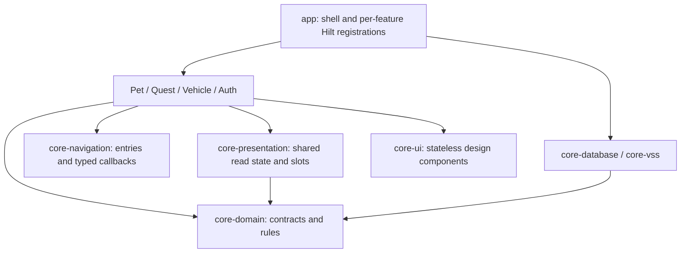

# Application architecture

This document owns module boundaries, state ownership, storage contracts and
platform integration. [DESIGN.md](DESIGN.md) owns product and screen behavior,
[TESTING.md](TESTING.md) owns verification strategy, and
[CONTRIBUTING.md](../.github/CONTRIBUTING.md) owns development procedures.

## Current foundation

The Android implementation has two in-app home surfaces, a transient home menu,
full-content destinations, persisted preferences and the legacy Q01 quest with
an XP reward. The product migration is in progress; no point reward values or
paid item catalog have been approved yet.

- `MobiMonApp` owns navigation, saved route state, the transient menu and the
  global AAOS restriction gate. A Hilt multibinding assembles independent
  `FeatureEntry` implementations; feature routes create and collect their own
  ViewModels. The shell has no feature action container or feature UI state.
- Settings and the Home conversation entry open the Copilot connection introduction.
  The shell preserves its Home/Settings origin across recreation. The
  [connection UI boundary](#copilot-connection-ui) separates the unavailable
  production integration from the eight-state Debug rehearsal.
- Room v3 stores the legacy profile, quest runs and completions, plus a separate
  point account, ledger, point quest occurrences, cosmetic catalog, ownership
  and equipment. V3 also contains the separate, currently unused leveling tables.
  DataStore stores independent preview, launcher and motion
  preferences. The launcher preference defaults to off, including after v1
  migration; the preview preference remains separate.
- Hilt wiring lives in `app/di`: `AppModule` binds repositories,
  `PlatformModule` constructs clock/storage, and variant-specific
  `VehicleProviderModule` supplies vehicle data.
- `CompanionRuntime` follows process foreground lifecycle and owns one vehicle
  provider and the AAOS UX restriction listener. Q01 completion is a user
  command; no background care tracker or system overlay service exists.
- Debug uses the simulated provider, `com.monsters.mobimon.demo`,
  `mobimon-demo.db` and `demo-profile`. Release uses the REAL unavailable
  provider, `mobimon.db` and `local-profile`. The demo freshness window is
  15 seconds; a real adapter needs a verified provider-specific policy.
  Display freshness samples the clock on every snapshot or timer emission, so a
  new reading is never compared against a cached, older timer timestamp.
- [PetAvatar](../core/core-ui/src/main/java/com/monsters/mobimon/core/ui/PetAvatar.kt)
  is the artwork replacement point for Home, customization and Copilot. The renderer accepts appearance/character/equipment display inputs, without
  a growth-stage parameter. Rewards, ownership, equipped appearance
  and interaction state stay outside the renderer. Asset provenance and fallback
  artwork belong in the [design guidance](DESIGN.md#reusable-compose-library-and-asset-handoff).

Q02/Q03 remain legacy identifiers, but are no longer offered as forthcoming
quests. Existing Q01-Q03 identifiers, rewards and completion records do not
automatically map to the new quest catalog.
Point transactions and free Mobi/Luna ownership and equipment are implemented.
The point quest catalog is intentionally empty until conditions and reward
amounts are defined; no XP is converted or mapped to point quests. Paid items,
AI conversation, a real vehicle SDK adapter and launcher display remain
unavailable. The UI does not claim those capabilities work.

## Scope and decisions

Use feature modules with MVVM and unidirectional data flow. Keep business rules
in plain Kotlin and expose data through constructor-injected repositories.
Introduce use cases for multi-step coordination when needed; no shared
Store/Reducer framework or pass-through use case is required.

Quest records and target point/cosmetic records remain local. There is no
dedicated backend, MobiMon account service, device synchronization or guaranteed
reinstall recovery. External AI access and vehicle integration require verified
adapters; simulated providers do not establish platform support.

## Target modules and dependencies

Add planned modules with their first working behavior and tests. Use
`com.monsters.mobimon` as the package root with feature/core subpackages.

| Gradle module | Responsibility | Allowed internal dependencies |
| --- | --- | --- |
| `:app` | Entry points, shell, process runtime, platform bindings and [feature registration](../app/src/main/java/com/monsters/mobimon/di/features) | Features and core implementations |
| `:core:core-domain` | Plain Kotlin models, narrow repository interfaces and business rules, split by subject | None |
| `:core:core-database` | One Room database, DataStore, migrations and atomic transactions | `core-domain` |
| `:core:core-vss` | Unavailable real vehicle adapter | `core-domain` |
| `:core:core-ui` | Stateless Compose components, palette roles, fonts and replaceable `PetAvatar` | None |
| `:core:core-navigation` | Typed destinations, feature entry and navigation callbacks; no feature state | None |
| `:core:core-presentation` | Shared wallet observation, vehicle display freshness, and vehicle contribution contract | `core-domain` |
| `:feature:feature-pet` | Companion workspace: Home, Shop/customization, Settings, inventory state and [PetFeature](../feature/feature-pet/src/main/java/com/monsters/mobimon/feature/pet/PetFeature.kt) | `core-domain`, `core-ui`, `core-navigation`, `core-presentation` |
| `:feature:feature-quest` | Quest workspace: commands, progress, rewards UI and [QuestFeature](../feature/feature-quest/src/main/java/com/monsters/mobimon/feature/quest/QuestFeature.kt) | Same four core modules |
| `:feature:feature-vehicle-info` | Vehicle workspace: readings, availability and [VehicleFeature](../feature/feature-vehicle-info/src/main/java/com/monsters/mobimon/feature/vehicle/VehicleFeature.kt) | Same four core modules |
| `:feature:feature-auth` | AI workspace: Copilot UI, conversation entry, AI context and [AiFeature](../feature/feature-auth/src/main/java/com/monsters/mobimon/feature/auth/AiFeature.kt); provider unavailable | Same four core modules |

Existing feature paths remain stable for in-flight branches. `feature-auth`
includes the AI entry; a separate Chat module is unnecessary while the same team
owns both and no independent conversation runtime exists. `core-ai` and overlay
integration remain planned; no production adapter or overlay module is present.
Shared test helpers remain module-local; no `core-testing` production dependency
is introduced.

Features do not depend on each other or concrete data implementations.
`core-domain` has no Android, Compose, Room, Hilt or SDK DTO dependencies. Map
storage/transport models at the implementation boundary and assemble bindings
in `app`. Keep helpers private or internal until another module needs a public
contract. Shared test helpers must never become production APK dependencies.

## State and lifecycle

The composition route obtains ViewModels and collects read-only `StateFlow`
with `collectAsStateWithLifecycle()`. Feature `*Screen` composables accept state,
callbacks and a `Modifier`; they do not obtain ViewModels, open databases or
call SDKs. ViewModels expose named actions and explicit phases where useful.
Keep feature state independent rather than creating an app-wide mutable state
container.

Destination enums are separate files in `core-navigation`: `CompanionRoute`,
`QuestRoute`, `VehicleRoute`, and `AiRoute`. Extending an existing enum does not
change the shell registry. Each `FeatureEntry` supplies its own destination
content. `FeatureRegistry` rejects duplicate or missing registrations and duplicate
saved route names across teams; Gradle's
`verifyModuleBoundaries` checks declared `ProjectDependency` entries in every
configuration, including those added by convention plugins. It also rejects the
Android library plugin and selected import prefixes in `core-domain/src/main`
Kotlin files. This is a guardrail, not a complete dependency audit: resolved
transitive libraries, other source sets, generated code, fully qualified type
references and SDK DTO types still require review against the boundaries above.

The current shell preserves the existing single-level navigation and Copilot
origin contract; `AppRoute.parent` supports an explicit parent for new screens.
Saved names remain compatible with the old enum values. A saveable-state holder
retains local screen state, and route ViewModels use the Activity's ViewModel
store, so navigation does not restart a pending command. Flows are collected with
the lifecycle; the process runtime remains the only owner of provider start/stop.
This is not a Navigation 3 migration: the pinned Compose/SDK toolchain and existing
Back behavior are retained. Multiple back stacks, route arguments or deep links
require a separately verified navigation integration.

`PointPresentation` and `VehiclePresentation` share only independently observed
read state. Home reads quest summaries through `QuestRepository`; AI reads
committed companion context through domain interfaces. Neither imports another
feature's ViewModel. AI retains its last committed context if observation fails;
the route exposes that failure and an explicit retry even after a profile has
loaded. Retry reconnects the combined observation without duplicating active jobs.
The Quest-owned `QuestFeature` implements a
`VehicleDetailContribution` assembled in `app/di/features/QuestFeatureModule`.
It renders the stateless `QuestVehicleCard` inside Vehicle's slot with the
currently displayed snapshot; only Quest dispatches acknowledgment to the reward
repository.

The shell owns transient menu state and cross-feature callbacks as defined in
[DESIGN.md](DESIGN.md). Shared component APIs never accept repositories or ViewModels. All features use
the v4 theme by default. Reusable panels, rows, actions, status badges and
selection controls live in `core-ui`; feature entries keep business state and
compose their own final layouts. See the [UI contracts](DESIGN.md#reusable-compose-library-and-asset-handoff).

| State | Owner and lifetime |
| --- | --- |
| Current profile, legacy XP, quest runs and completions | Room-backed repository; durable |
| Visibility and reduced-motion preferences | DataStore-backed repository; durable |
| Legacy growth stage | Historical XP can still be interpreted by `RewardCalculator`, but no growth stage is shown on the product home |
| Vehicle snapshot availability and driving state | Derived from valid current signals |
| Route/menu position | Shell; restore route but not a transient open menu |
| Coordinates, hover and animation progress | Renderer; not shared business state |

### Copilot connection UI

The independent `feature-auth` module exposes
[CopilotUiState and CopilotAction](../feature/feature-auth/src/main/java/com/monsters/mobimon/feature/auth/CopilotUiState.kt)
through the stateless
[CopilotConnectionScreen](../feature/feature-auth/src/main/java/com/monsters/mobimon/feature/auth/CopilotConnectionScreen.kt).
The host supplies display data, an optional QR painter, interaction authorization,
the reduced-motion preference and action handling. The screen accepts no access
token, creates no account session and performs no provider calls or polling.
It renders expiry instead of a waiting state with no remaining time. Rendering
`Connected` is a presentation decision, not evidence of approval or Copilot readiness.

[AiFeature](../feature/feature-auth/src/main/java/com/monsters/mobimon/feature/auth/AiFeature.kt)
hosts introduction/unavailable feedback. The shell saves route origin, and the
AI route saves feedback across Activity recreation. Its interaction guard combines parked verification
and app-use allowance. The other states are reusable presentation components;
production integration remains [planned](#ai-conversation-and-session).

[CopilotPreviewActivity](../feature/feature-auth/src/debug/java/com/monsters/mobimon/feature/auth/preview/CopilotPreviewActivity.kt)
is a separate Debug-only launcher that connects those same components. Example
accounts/codes, its fixed timer and scenario controls belong to the rehearsal,
not a provider implementation; its UI behavior is defined in
[DESIGN.md](DESIGN.md#copilot-connection-ui). The Activity saves only its review state across
recreation; simulated pending work runs while STARTED and is canceled when its
step is left. It neither verifies vehicle restrictions nor performs
authentication or account persistence. Its launcher and sample QR resource are
absent from Release.

### Vehicle interaction authorization

Vehicle ownership belongs to `CompanionRuntime`, not individual screen
collectors. Reopening a route must not create another provider connection.
Clean up listeners and jobs when their runtime ends.

Allow quest commands and future text interaction only in verified parked state;
unknown state cannot authorize them. Legacy Q01 completion requires a snapshot
newer than its start sequence in the same observation epoch. After an observation
gap, fresh parked evidence may cancel the old run so the user can restart; it cannot
complete that run. Saved progress does not prove current vehicle state.
Missing/stale data stays unavailable; preserve a last known warning only as
historical information.

Interaction authorization requires both verified parked evidence and the current
display's allowance from `CarUxRestrictionsManager` on AAOS.
[Parked-activity restrictions](https://developer.android.com/training/cars/parked/automotive-os#meet-driver-distraction-requirements)
take precedence over assumptions based on gear or speed. Map platform restrictions
through `CarAppUseMonitor`; Android APIs stay out of `core-domain`. The monitor
fails closed on AAOS until it has a current reading. It returns to unavailable
when the Car service disconnects, then reloads UX
restrictions on reconnect before allowing an action. Quest, point award,
purchase and equipment commands recheck current authorization in their Room
transaction. Later restriction changes preserve already committed records.

## Domain and storage contracts

[Quest models](../core/core-domain/src/main/kotlin/com/monsters/mobimon/core/domain/QuestModels.kt)
and [repository interfaces](../core/core-domain/src/main/kotlin/com/monsters/mobimon/core/domain/QuestRepository.kt)
define legacy fields and outcomes. [Point economy contracts](../core/core-domain/src/main/kotlin/com/monsters/mobimon/core/domain/PointEconomy.kt)
are separate from XP. Observations use `Flow`; write
commands are suspending and distinguish rejected, duplicate and storage-failure
outcomes. Coroutine cancellation propagates.

- Vehicle snapshots identify source, quality, receive time, epoch and sequence.
  Real adapters must normalize units and define measurement time/order and
  freshness policies without mixing clock domains or reusing process-local
  monotonic timestamps after restart.
- Parking, battery and each warning can carry separate quality and observation
  time. The display freshness policy evaluates each independently; a fresh
  battery cannot refresh stale parking, and an old warning is historical.
  Unsupported, denied and disconnected reasons are explicit where known.
- Pet repositories expose committed profiles and appearance changes, with no
  arbitrary reward-balance setter. Settings remain independent of rewards.
- Quest runs fix profile/source ownership, rule version, reward and start
  boundary. Commands recheck revision and allow one active run per profile.
- Evidence must be applicable to the run and backed by a valid signal or the
  required user-confirmed fact; an AI assertion cannot complete a quest.
- Inject clocks, IDs, dispatchers and scopes where behavior depends on them.

Use one Room database per app process. Profile, run and completion writes belong
to the local repository. The legacy schema enforces unique completion by both
run ID and `(profileId, questType)`. Persist the evidence needed for a run/result
without adding full vehicle histories or chat transcripts.

The current [Room schema](../core/core-database/src/main/java/com/monsters/mobimon/core/database/AppDatabase.kt)
is version 3, with exported schema snapshots. V3 adds `user_profiles` and
`drive_daily_summaries`; those tables do not replace the point wallet or authorize
new reward behavior. Legacy [entities](../core/core-database/src/main/java/com/monsters/mobimon/core/database/CompanionEntities.kt)
store `totalXp`, `rewardXp` and `awardedXp`; Q01 awards 80 XP once per profile,
while Q02/Q03 remain unsupported. `RewardCalculator` can interpret historical
saved XP but does not drive the product home. These fields and values are current implementation facts, not target
point rewards or conversion rates.

Earlier development v3 databases predate fields now present in the entities and
export. They need a new versioned, non-destructive migration before upgrades can
be supported; updating the v3 export alone does not migrate those installations.
The [migration coverage](TESTING.md#integration-boundaries) does not establish
that upgrade path.

`MIGRATION_1_2` preserves all v1 profile, run and completion evidence. It
creates zero-balance point accounts and grants the two free friends without
creating historical point credits. The new point quest occurrence table has a
unique `(profileId, questId, occurrenceKey)` index; a matching unique ledger
reference protects each credit. Daily occurrence keys use each quest's defined
reset zone, while one-time quests use a permanent key. The production catalog
is empty pending product decisions.

Current completion follows one atomic boundary:

1. Validate evidence against the fixed rule, start boundary and current
   observation. Reject stale/replayed evidence and simulated evidence for real
   progression.
2. Inside one Room transaction, reload the run and recheck ownership, revision,
   active status, evidence and prior completion. Cancellation and concurrent
   completion must not bypass these checks.
3. Insert the unique completion, mark the run complete and increment XP only for
   the new completion. Any failure rolls back every write; duplicates leave XP
   unchanged. Never replace reward records on conflict.
4. Publish committed state through repository observations. Result UI follows the
   commit and never triggers the reward itself.

Keep all reward writes in this transaction, never split across repositories or
Room/DataStore. Keep network calls outside transactions. A lossy UI event cannot
be the only record of a granted reward.

## Planned features

The contracts below include implemented foundations and remaining integration
work. Product behavior and reward rules belong in [DESIGN.md](DESIGN.md). Verification belongs
in [TESTING.md](TESTING.md); implementation breakdowns belong in feature issues.

### Points, cosmetics and quest occurrences

Implemented: accounts, ledger, occurrence uniqueness, purchases, ownership,
equipment and free friends were introduced in Room v2 and remain in current v3.
See the [test requirement map](TESTING.md#current-requirement-map) for coverage.
The production quest and paid-item catalogs have no approved entries. The legacy Q01 is still an XP
demo and does not grant points. Point awards require a trusted catalog entry,
current matching vehicle evidence and app-use authorization. The current award
API supports a displayed vehicle-card acknowledgment; additional quest
conditions require dedicated evidence validators before catalog activation.

Represent spendable points separately from legacy cumulative XP. Store the local
balance, durable credit/debit ledger, owned cosmetic items and equipped selection
in Room. Use stable quest/item identifiers and keep catalog data, ownership and
equipment distinct.

All quest awards must preserve the applicable ownership, revision, evidence and
source checks in the [storage contract](#domain-and-storage-contracts). The current
vehicle-card point API validates a catalog entry and current vehicle evidence,
then atomically inserts the occurrence, credits its ledger and updates the
balance. It has no run handle and must not be used for run-based rules. A
run-based point extension must recheck the run and finish it inside that same
reward transaction. UI code and AI replies cannot directly change balances or
grant items.

Support one-time and repeat reward categories. One-time rewards remain unique
per profile and quest. Repeat rewards require an explicit occurrence key and a
uniqueness constraint covering profile, quest and occurrence, in addition to
run uniqueness. Translate the [reward schedule](DESIGN.md#quests-and-points) into
an explicit reset time zone, clock policy, qualifying evidence and interruption
behavior. Do not enable recurrence by simply removing the current completion constraint.

A purchase command must atomically validate the item and applicable price,
ownership and sufficient balance; write a unique purchase/debit; deduct points;
and grant ownership. Equipment is a separate command after committed ownership.
Repeated requests and concurrent purchases cannot double charge, overspend or
duplicate ownership. Any failure rolls back all changes. Validate ownership in
the equipment command without writing another debit. Publish balance, inventory
and equipment changes after commit.
Preserve separate Debug/demo and Release identities for these records too.

Migrate the versioned Room schema without destructive reset. Define how existing
XP, appearance choices, active runs and Q01-Q03 completions map to the new catalog
before adding a migration; no automatic 1:1 XP-to-point conversion or quest-ID
mapping is assumed. Preserve historical reward evidence and use deterministic
migration records so reopening cannot credit old rewards twice. Legacy XP remains
stored for historical evidence, while the visible home uses points and does not
show growth stages. The legacy Q01 UI is available only with simulated Debug
vehicle data until the new catalog is ready.

### Shared vehicle condition and overlay

Combine committed profile and equipped appearance with the shared vehicle stream
in an application-level state producer for home, supported launcher character
surfaces and chat. Consumers must not create new vehicle subscriptions;
`core-database` must not reach into `core-vss` to assemble state. The resulting `PetState` carries profile,
selected character, equipped cosmetics and current condition with its reason.
Points and ownership remain repository state; the renderer does not manage them.

Quest observation belongs to the supported runtime lifecycle, not a screen
collector. Process death or observation gaps begin a new epoch and leave quest
progress unverified until new evidence or trustworthy provider history permits
resuming. Uninterrupted background tracking is not guaranteed.

Launcher character support is conditional on a verified platform integration.
The current `show_on_vehicle_home` DataStore preference defaults to true and only
controls the in-app preview. It must not authorize launcher display. The
separate launcher visibility preference defaults to false, including for
existing installations. Require an explicit user opt-in before displaying the
character there. Keep the preview preference and launcher preference independent.
`launcher_character_enabled` is persisted separately with an off default;
there is no launcher renderer or supported opt-in UI yet. The settings screen
continues to report launcher display as unavailable.
An overlay implementation uses a lifecycle-owned state holder, not an Activity
ViewModel. Observe actual service/permission state separately from the saved
visibility preference. Verify service restart, permission failures and parked
restrictions in the supplied AAOS environment before enabling interaction.
Unsupported signals stay unavailable; neither a launcher preference nor a
rendered vehicle value proves platform support.

[`TYPE_APPLICATION_OVERLAY`](https://developer.android.com/reference/android/view/WindowManager.LayoutParams#TYPE_APPLICATION_OVERLAY)
requires `SYSTEM_ALERT_WINDOW`; this permission is separate from an OEM
launcher/SystemUI integration. Require an explicit platform contract for launcher
visibility and placement. Do not assume a normal app knows when the launcher is
foreground or where its unused space is.

### AI conversation and session

The [connection UI](#copilot-connection-ui) is implemented; the live provider,
credential store and conversation runtime are not. A future provider host must
own cancellation, elapsed time, account validation and secret storage, and emit
success only after both account approval and Copilot readiness are verified.
The Debug rehearsal must not become the production source of connection state.

The target uses the user's personal Copilot connection. Keep its adapter behind
the domain boundary and authenticate through a supported user credential flow;
never embed shared service secrets. The [Copilot SDK setup documentation](https://docs.github.com/en/copilot/how-tos/copilot-sdk/setup/bundled-cli)
requires a separate CLI or running CLI server for Java. This does not establish
Android support: verify runtime/ABI compatibility, process or server access,
authentication and lifecycle on the target device. A relay would be a separate
infrastructure decision. Until the integration works, expose it as unavailable.

Implement the [conversation lifetime](DESIGN.md#conversation) with a
profile-scoped in-memory session shared by supported companion surfaces. Keep
dialogue and pending requests out of Room, DataStore, `SavedStateHandle` and
`rememberSaveable`. Bound request context using configurable limits.

Apply that lifetime to SDK/runtime artifacts too. The [SDK session contract](https://docs.github.com/en/copilot/how-tos/copilot-sdk/setup/bundled-cli#session-management)
persists session state under `~/.copilot/session-state/`. Verify storage
suppression or deletion across disconnect, restart and failure before claiming
in-memory-only conversation. If the runtime cannot meet this contract, update
the [storage disclosure](DESIGN.md#conversation) before enabling it.

Cancel work when its owning interaction ends. Invalidate pending requests when
the session, connection, profile or relevant context changes. Accept a reply only
when request/session/profile identifiers and context revision still match, even
if provider cancellation fails. Make timeouts injectable and retry explicit;
retries must not duplicate saved commands.

`AiGateway` receives bounded dialogue, committed companion/quest state and valid
vehicle facts. It may return replies and allowlisted proposals, but cannot write
storage, vehicle state, points or ownership. Application commands still require
their evidence or user confirmation. AI failure leaves vehicle information,
quests and cosmetics usable.

The voice adapter owns microphone permission, capture and cancellation state
separately from AI request state. Verify capture support and cleanup on the target
Android runtime; apply the same session-retention contract to transcripts and
runtime artifacts. Composer, listening and failure presentation follow
[DESIGN.md](DESIGN.md#conversation).
