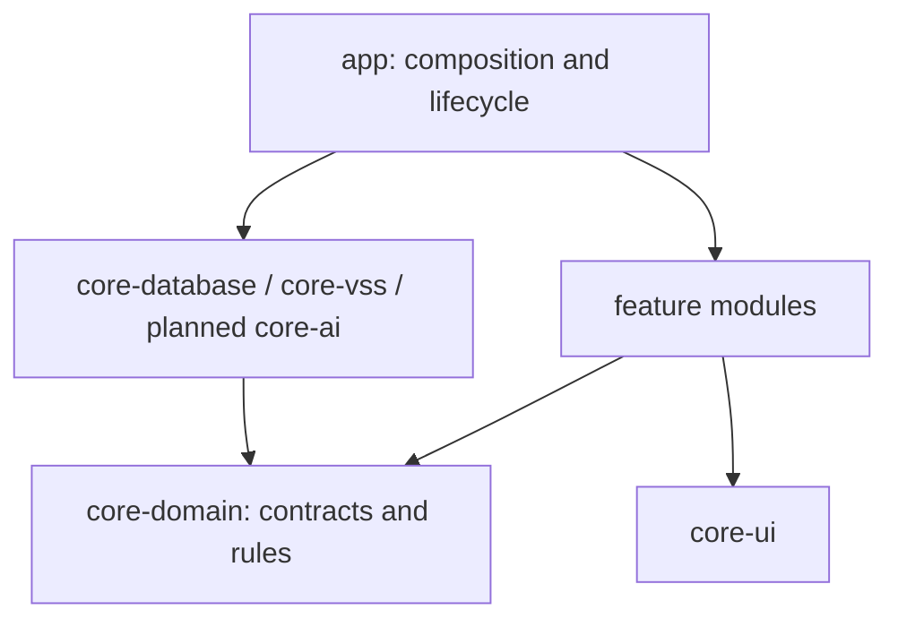

# Application architecture

This document owns module boundaries, state ownership, storage contracts and
platform integration. [DESIGN.md](DESIGN.md) owns product and screen behavior,
[TESTING.md](TESTING.md) owns verification strategy, and
[CONTRIBUTING.md](../.github/CONTRIBUTING.md) owns development procedures.

## Current foundation

The Android implementation has two in-app home surfaces, a transient home menu,
full-content destinations, persisted preferences and the legacy Q01 quest with
an XP reward. The product migration is in progress; no point reward values or
paid item catalog have been approved yet.

- `MobiMonApp` owns typed routes and composes independent Pet, Quest, vehicle,
  point-balance and cosmetic-inventory ViewModel state. `CompanionMenu` is a
  transient overlay; destinations use the full content area.
- Room v2 stores the legacy profile, quest runs and completions, plus a separate
  point account, ledger, point quest occurrences, cosmetic catalog, ownership
  and equipment. DataStore stores independent preview, launcher and motion
  preferences. The launcher preference defaults to off, including after v1
  migration; the preview preference remains separate.
- Hilt wiring lives in `app/di`: `AppModule` binds repositories,
  `PlatformModule` constructs clock/storage, and variant-specific
  `VehicleProviderModule` supplies vehicle data.
- `CompanionRuntime` follows process foreground lifecycle and owns one vehicle
  provider and the AAOS UX restriction listener. Q01 completion is a user
  command; no background care tracker or system overlay service exists.
- Debug uses the simulated provider, `com.monsters.mobimon.demo`,
  `mobimon-demo.db` and `demo-profile`. Release uses the REAL unavailable
  provider, `mobimon.db` and `local-profile`. The demo freshness window is
  15 seconds; a real adapter needs a verified provider-specific policy.
  Display freshness samples the clock on every snapshot or timer emission, so a
  new reading is never compared against a cached, older timer timestamp.
- [PetAvatar](../core/core-ui/src/main/java/com/monsters/mobimon/core/ui/PetAvatar.kt)
  is the artwork replacement point. Mobi's default artwork is exported from
  Figma P01 letterbox Home (128:569); Luna and legacy Cream still use placeholders. Preserve
  the compatibility signature `PetAvatar(modifier, appearanceKey, stage)`. `stage`
  belongs to the legacy implementation. Rewards, ownership, equipped appearance
  and interaction state stay outside the renderer.

Q02/Q03 remain legacy identifiers, but are no longer offered as forthcoming
quests. Existing Q01-Q03 identifiers, rewards and completion records do not
automatically map to the new quest catalog.
Point transactions and free Mobi/Luna ownership and equipment are implemented.
The point quest catalog is intentionally empty until conditions and reward
amounts are defined; no XP is converted or mapped to point quests. Paid items,
AI conversation, a real vehicle SDK adapter and launcher display remain
unavailable. The UI does not claim those capabilities work.

## Scope and decisions

Use feature modules with MVVM and unidirectional data flow. Keep business rules
in plain Kotlin and expose data through constructor-injected repositories.
Introduce use cases for multi-step coordination when needed; no shared
Store/Reducer framework or pass-through use case is required.

Quest records and target point/cosmetic records remain local. There is no
dedicated backend, MobiMon account service, device synchronization or guaranteed
reinstall recovery. External AI access and vehicle integration require verified
adapters; simulated providers do not establish platform support.

## Target modules and dependencies

Add planned modules with their first working behavior and tests. Use
`com.monsters.mobimon` as the package root with feature/core subpackages.

| Gradle module | Status | Responsibility | Allowed internal dependencies |
| --- | --- | --- | --- |
| `:app` | Implemented | Entry points, composition, shell and runtime | Features and core implementations |
| `:core:core-domain` | Implemented | Models, repository interfaces and rules | None; Kotlin and coroutines only |
| `:core:core-database` | Implemented | Room, DataStore and local transactions | `core-domain` |
| `:core:core-vss` | Implemented | Vehicle boundary; currently unavailable real provider | `core-domain` |
| `:core:core-ui` | Implemented | Theme, shared renderer and controls | No feature modules |
| `:feature:feature-pet` | Implemented | Home, appearance and display settings | `core-domain`, `core-ui` |
| `:feature:feature-vehicle-info` | Implemented | Vehicle information and availability UI | `core-domain`, `core-ui` |
| `:feature:feature-quest` | Implemented | Quest selection, progress and results | `core-domain`, `core-ui` |
| `:core:core-ai` | Planned | AI client adapter and response parsing | `core-domain` |
| `:feature:feature-overlay` | Planned | Overlay lifecycle and permissions | `core-domain`, `core-ui` |
| `:feature:feature-chat` | Planned | Conversation and session | `core-domain`, `core-ui` |
| `:core:core-testing` | Optional, unimplemented | Shared JVM test helpers | `core-domain`; test consumers only |

Features do not depend on each other or concrete data implementations.
`core-domain` has no Android, Compose, Room, Hilt or SDK DTO dependencies. Map
storage/transport models at the implementation boundary and assemble bindings
in `app`. Keep helpers private or internal until another module needs a public
contract. Shared test helpers must never become production APK dependencies.

## State and lifecycle

The composition route obtains ViewModels and collects read-only `StateFlow`
with `collectAsStateWithLifecycle()`. Feature `*Screen` composables accept state,
callbacks and a `Modifier`; they do not obtain ViewModels, open databases or
call SDKs. ViewModels expose named actions and explicit phases where useful.
Keep feature state independent rather than creating an app-wide mutable state
container.

The shell owns typed destinations, transient menu state and cross-feature
callbacks as defined in [DESIGN.md](DESIGN.md).

| State | Owner and lifetime |
| --- | --- |
| Current profile, legacy XP, quest runs and completions | Room-backed repository; durable |
| Visibility and reduced-motion preferences | DataStore-backed repository; durable |
| Legacy growth stage | Historical XP can still be interpreted by `RewardCalculator`, but no growth stage is shown on the product home |
| Vehicle snapshot availability and driving state | Derived from valid current signals |
| Route/menu position | Shell; restore route but not a transient open menu |
| Coordinates, hover and animation progress | Renderer; not shared business state |

Vehicle ownership belongs to `CompanionRuntime`, not individual screen
collectors. Reopening a route must not create another provider connection.
Clean up listeners and jobs when their runtime ends.

Allow quest commands and future text interaction only in verified parked state;
unknown state cannot authorize them. Legacy Q01 completion requires a snapshot
newer than its start sequence in the same observation epoch. After an observation
gap, fresh parked evidence may cancel the old run so the user can restart; it cannot
complete that run. Saved progress does not prove current vehicle state.
Missing/stale data stays unavailable; preserve a last known warning only as
historical information.

Interaction authorization requires both verified parked evidence and the current
display's allowance from `CarUxRestrictionsManager` on AAOS.
[Parked-activity restrictions](https://developer.android.com/training/cars/parked/automotive-os#meet-driver-distraction-requirements)
take precedence over assumptions based on gear or speed. Map platform restrictions
through `CarAppUseMonitor`; Android APIs stay out of `core-domain`. The monitor
fails closed on AAOS until it has a current reading. It returns to unavailable
when the Car service disconnects, then reloads UX
restrictions on reconnect before allowing an action. Quest, point award,
purchase and equipment commands recheck current authorization in their Room
transaction. Later restriction changes preserve already committed records.

## Domain and storage contracts

[Models](../core/core-domain/src/main/kotlin/com/monsters/mobimon/core/domain/Models.kt)
and [repository interfaces](../core/core-domain/src/main/kotlin/com/monsters/mobimon/core/domain/Repositories.kt)
define legacy fields and outcomes. [Point economy contracts](../core/core-domain/src/main/kotlin/com/monsters/mobimon/core/domain/PointEconomy.kt)
are separate from XP. Observations use `Flow`; write
commands are suspending and distinguish rejected, duplicate and storage-failure
outcomes. Coroutine cancellation propagates.

- Vehicle snapshots identify source, quality, receive time, epoch and sequence.
  Real adapters must normalize units and define measurement time/order and
  freshness policies without mixing clock domains or reusing process-local
  monotonic timestamps after restart.
- Parking, battery and each warning can carry separate quality and observation
  time. The display freshness policy evaluates each independently; a fresh
  battery cannot refresh stale parking, and an old warning is historical.
  Unsupported, denied and disconnected reasons are explicit where known.
- Pet repositories expose committed profiles and appearance changes, with no
  arbitrary reward-balance setter. Settings remain independent of rewards.
- Quest runs fix profile/source ownership, rule version, reward and start
  boundary. Commands recheck revision and allow one active run per profile.
- Evidence must be applicable to the run and backed by a valid signal or the
  required user-confirmed fact; an AI assertion cannot complete a quest.
- Inject clocks, IDs, dispatchers and scopes where behavior depends on them.

Use one Room database per app process. Profile, run and completion writes belong
to the local repository. The legacy schema enforces unique completion by both
run ID and `(profileId, questType)`. Persist the evidence needed for a run/result
without adding full vehicle histories or chat transcripts.

The current [Room schema](../core/core-database/src/main/java/com/monsters/mobimon/core/database/AppDatabase.kt)
is version 2. Legacy [entities](../core/core-database/src/main/java/com/monsters/mobimon/core/database/CompanionEntities.kt)
store `totalXp`, `rewardXp` and `awardedXp`; Q01 awards 80 XP once per profile,
while Q02/Q03 remain unsupported. `RewardCalculator` can interpret historical
saved XP but does not drive the product home. These fields and values are current implementation facts, not target
point rewards or conversion rates.

`MIGRATION_1_2` preserves all v1 profile, run and completion evidence. It
creates zero-balance point accounts and grants the two free friends without
creating historical point credits. The new point quest occurrence table has a
unique `(profileId, questId, occurrenceKey)` index; a matching unique ledger
reference protects each credit. Daily occurrence keys use each quest's defined
reset zone, while one-time quests use a permanent key. The production catalog
is empty pending product decisions.

Current completion follows one atomic boundary:

1. Validate evidence against the fixed rule, start boundary and current
   observation. Reject stale/replayed evidence and simulated evidence for real
   progression.
2. Inside one Room transaction, reload the run and recheck ownership, revision,
   active status, evidence and prior completion. Cancellation and concurrent
   completion must not bypass these checks.
3. Insert the unique completion, mark the run complete and increment XP only for
   the new completion. Any failure rolls back every write; duplicates leave XP
   unchanged. Never replace reward records on conflict.
4. Publish committed state through repository observations. Result UI follows the
   commit and never triggers the reward itself.

Keep all reward writes in this transaction, never split across repositories or
Room/DataStore. Keep network calls outside transactions. A lossy UI event cannot
be the only record of a granted reward.

## Planned features

The contracts below include implemented foundations and remaining integration
work. Product behavior and reward rules belong in [DESIGN.md](DESIGN.md). Verification belongs
in [TESTING.md](TESTING.md); implementation breakdowns belong in feature issues.

### Points, cosmetics and quest occurrences

Implemented: Room v2 accounts, ledger, occurrence uniqueness, purchases,
ownership, equipment, free friends, and migration tests. The production quest
and paid-item catalogs have no approved entries. The legacy Q01 is still an XP
demo and does not grant points. Point awards require a trusted catalog entry,
current matching vehicle evidence and app-use authorization. The current award
API supports a displayed vehicle-card acknowledgment; additional quest
conditions require dedicated evidence validators before catalog activation.

Represent spendable points separately from legacy cumulative XP. Store the local
balance, durable credit/debit ledger, owned cosmetic items and equipped selection
in Room. Use stable quest/item identifiers and keep catalog data, ownership and
equipment distinct.

Quest awards retain the evidence, ownership, revision and source checks above.
Atomically insert the unique completion and its ledger credit, finish the run
and update the point balance. Link each award to one completion occurrence so
retrying or replaying an event cannot credit it again. UI code and AI replies
cannot directly change balances or grant items.

Support one-time and repeat reward categories. One-time rewards remain unique
per profile and quest. Repeat rewards require an explicit occurrence key and a
uniqueness constraint covering profile, quest and occurrence, in addition to
run uniqueness. Translate the [reward schedule](DESIGN.md#quests-and-points) into
an explicit reset time zone, clock policy, qualifying evidence and interruption
behavior. Do not enable recurrence by simply removing the current completion constraint.

A purchase command must atomically validate the item and applicable price,
ownership and sufficient balance; write a unique purchase/debit; deduct points;
and grant ownership. Equipment is a separate command after committed ownership.
Repeated requests and concurrent purchases cannot double charge, overspend or
duplicate ownership. Any failure rolls back all changes. Validate ownership in
the equipment command without writing another debit. Publish balance, inventory
and equipment changes after commit.
Preserve separate Debug/demo and Release identities for these records too.

Migrate the versioned Room schema without destructive reset. Define how existing
XP, appearance choices, active runs and Q01-Q03 completions map to the new catalog
before adding a migration; no automatic 1:1 XP-to-point conversion or quest-ID
mapping is assumed. Preserve historical reward evidence and use deterministic
migration records so reopening cannot credit old rewards twice. Legacy XP remains
stored for historical evidence, while the visible home uses points and does not
show growth stages. The legacy Q01 UI is available only with simulated Debug
vehicle data until the new catalog is ready.

### Shared vehicle condition and overlay

Combine committed profile and equipped appearance with the shared vehicle stream
in an application-level state producer for home, supported launcher character
surfaces and chat. Consumers must not create new vehicle subscriptions;
`core-database` must not reach into `core-vss` to assemble state. The resulting `PetState` carries profile,
selected character, equipped cosmetics and current condition with its reason.
Points and ownership remain repository state; the renderer does not manage them.

Quest observation belongs to the supported runtime lifecycle, not a screen
collector. Process death or observation gaps begin a new epoch and leave quest
progress unverified until new evidence or trustworthy provider history permits
resuming. Uninterrupted background tracking is not guaranteed.

Launcher character support is conditional on a verified platform integration.
The current `show_on_vehicle_home` DataStore preference defaults to true and only
controls the in-app preview. It must not authorize launcher display. The
separate launcher visibility preference defaults to false, including for
existing installations. Require an explicit user opt-in before displaying the
character there. Keep the preview preference and launcher preference independent.
`launcher_character_enabled` is persisted separately with an off default;
there is no launcher renderer or supported opt-in UI yet. The settings screen
continues to report launcher display as unavailable.
An overlay implementation uses a lifecycle-owned state holder, not an Activity
ViewModel. Observe actual service/permission state separately from the saved
visibility preference. Verify service restart, permission failures and parked
restrictions in the supplied AAOS environment before enabling interaction.
Unsupported signals stay unavailable; neither a launcher preference nor a
rendered vehicle value proves platform support.

[`TYPE_APPLICATION_OVERLAY`](https://developer.android.com/reference/android/view/WindowManager.LayoutParams#TYPE_APPLICATION_OVERLAY)
requires `SYSTEM_ALERT_WINDOW`; this permission is separate from an OEM
launcher/SystemUI integration. Require an explicit platform contract for launcher
visibility and placement. Do not assume a normal app knows when the launcher is
foreground or where its unused space is.

### AI conversation and session

The target uses the user's personal Copilot connection. Keep its adapter behind
the domain boundary and authenticate through a supported user credential flow;
never embed shared service secrets. The [Copilot SDK setup documentation](https://docs.github.com/en/copilot/how-tos/copilot-sdk/setup/bundled-cli)
requires a separate CLI or running CLI server for Java. This does not establish
Android support: verify runtime/ABI compatibility, process or server access,
authentication and lifecycle on the target device. A relay would be a separate
infrastructure decision. Until the integration works, expose it as unavailable.

Implement the [conversation lifetime](DESIGN.md#conversation) with a
profile-scoped in-memory session shared by supported companion surfaces. Keep
dialogue and pending requests out of Room, DataStore, `SavedStateHandle` and
`rememberSaveable`. Bound request context using configurable limits.

Apply that lifetime to SDK/runtime artifacts too. The [SDK session contract](https://docs.github.com/en/copilot/how-tos/copilot-sdk/setup/bundled-cli#session-management)
persists session state under `~/.copilot/session-state/`. Verify storage
suppression or deletion across disconnect, restart and failure before claiming
in-memory-only conversation. If the runtime cannot meet this contract, update
the [storage disclosure](DESIGN.md#conversation) before enabling it.

Cancel work when its owning interaction ends. Invalidate pending requests when
the session, connection, profile or relevant context changes. Accept a reply only
when request/session/profile identifiers and context revision still match, even
if provider cancellation fails. Make timeouts injectable and retry explicit;
retries must not duplicate saved commands.

`AiGateway` receives bounded dialogue, committed companion/quest state and valid
vehicle facts. It may return replies and allowlisted proposals, but cannot write
storage, vehicle state, points or ownership. Application commands still require
their evidence or user confirmation. AI failure leaves vehicle information,
quests and cosmetics usable.

The voice adapter owns microphone permission, capture and cancellation state
separately from AI request state. Verify capture support and cleanup on the target
Android runtime; apply the same session-retention contract to transcripts and
runtime artifacts. Composer, listening and failure presentation follow
[DESIGN.md](DESIGN.md#conversation).
