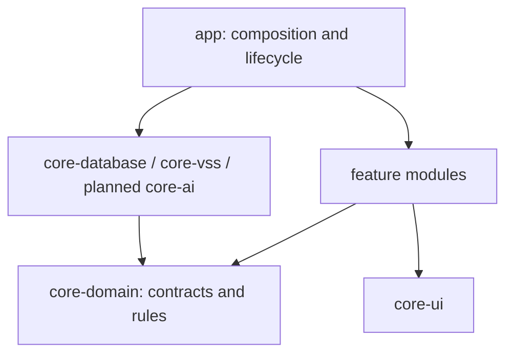

# Application architecture

This document defines the current structure and the contracts for planned
features. See [DESIGN.md](DESIGN.md) for UI behavior,
[TESTING.md](TESTING.md) for test coverage and
[CONTRIBUTING.md](../.github/CONTRIBUTING.md) for development procedures.

## Current foundation

The implemented modules deliver two native home surfaces, a shared drawer,
appearance/settings persistence and the Q01 status-acknowledgment quest.

- `MobiMonApp` collects feature-owned Pet/Quest ViewModel state with lifecycle
  awareness. Feature screens accept state and callbacks; `CompanionDrawer`
  owns the shared drawer frame.
- Room stores a local profile, quest runs and completions. One repository
  implements the pet/quest/reward interfaces and owns the reward transaction.
  DataStore stores visibility and reduced-motion preferences.
- Hilt wiring lives in `app/di`: `AppModule` binds repositories,
  `PlatformModule` constructs clock/storage, and variant-specific
  `VehicleProviderModule` supplies vehicle data. Ordinary unit tests construct
  subjects directly; shared app UI journeys use Hilt as described in TESTING.
- `CompanionRuntime` follows process foreground lifecycle and owns one vehicle
  provider. Q01 completion is a user command; no background care tracker or
  system overlay service exists.
- Debug uses the simulated provider, `com.monsters.mobimon.demo`,
  `mobimon-demo.db` and `demo-profile`. Release uses the REAL unavailable
  provider, `mobimon.db` and `local-profile`. The demo freshness window is
  15 seconds; a real adapter needs a verified provider-specific policy.
- [PetAvatar](../core/core-ui/src/main/java/com/monsters/mobimon/core/ui/PetAvatar.kt)
  is the artwork replacement point. Preserve
  `PetAvatar(modifier, appearanceKey, stage)`; keep progression and interaction
  state outside the renderer while separate assets are prepared.

Q02/Q03 are visible future quests. AI conversation, consented memories, a real
vehicle SDK adapter, system overlay and shared test helpers remain unimplemented.

## Scope and decisions

Use feature modules with MVVM and unidirectional data flow. Keep business rules
in plain Kotlin and expose data through constructor-injected repositories.
Introduce use cases for multi-step coordination when needed; no shared
Store/Reducer framework or pass-through use case is required.

Progress and consented memories are local. There is no dedicated backend, account
service, device synchronization or guaranteed reinstall recovery. Real AI and
vehicle integration remain acceptance requirements; simulated providers support
development but do not establish platform support.

Product rules come from the agreed [quest/growth scope](https://app.notion.com/p/3d3071f5db1f8140997cec6f7d991c0d)
and [AI/memory scope](https://app.notion.com/p/3d3071f5db1f81d88132fc2fd4eb1a33).
The module design adapts [MobiMon at commit 74891dd](https://github.com/myme4u/MobiMon/blob/74891ddb819745df1397c6ee1db236809769830e/MobiMon.md);
that reference's dependency versions and driving-habit scoring are not this
project's baseline.

## Target modules and dependencies

Add planned modules with their first working behavior and tests. Use
`com.monsters.mobimon` as the package root with feature/core subpackages.

| Gradle module | Status | Responsibility | Allowed internal dependencies |
| --- | --- | --- | --- |
| `:app` | Implemented | Entry points, composition, shell and runtime | Features and core implementations |
| `:core:core-domain` | Implemented | Models, repository interfaces and rules | None; Kotlin and coroutines only |
| `:core:core-database` | Implemented | Room, DataStore and local transactions | `core-domain` |
| `:core:core-vss` | Implemented | Vehicle boundary; currently unavailable real provider | `core-domain` |
| `:core:core-ui` | Implemented | Theme, shared renderer and controls | No feature modules |
| `:feature:feature-pet` | Implemented | Home, appearance and display settings | `core-domain`, `core-ui` |
| `:feature:feature-vehicle-info` | Implemented | Vehicle information and availability UI | `core-domain`, `core-ui` |
| `:feature:feature-quest` | Implemented | Quest selection, progress and results | `core-domain`, `core-ui` |
| `:core:core-ai` | Planned | AI client adapter and response parsing | `core-domain` |
| `:feature:feature-overlay` | Planned | Overlay lifecycle and permissions | `core-domain`, `core-ui` |
| `:feature:feature-chat` | Planned | Conversation, memory consent and session | `core-domain`, `core-ui` |
| `:core:core-testing` | Optional, unimplemented | Shared JVM test helpers | `core-domain`; test consumers only |

Features do not depend on each other or concrete data implementations.
`core-domain` has no Android, Compose, Room, Hilt or SDK DTO dependencies. Map
storage/transport models at the implementation boundary and assemble bindings
in `app`. Keep helpers private or internal until another module needs a public
contract. Shared test helpers must never become production APK dependencies.

## State and lifecycle

The composition route obtains ViewModels and collects read-only `StateFlow`
with `collectAsStateWithLifecycle()`. Feature `*Screen` composables accept state,
callbacks and a `Modifier`; they do not obtain ViewModels, open databases or
call SDKs. ViewModels expose named actions and explicit phases where useful.
Keep feature state independent rather than creating an app-wide mutable state
container.

The shell owns typed destinations and cross-feature callbacks. Its drawer is an
in-screen state machine; detail back returns to the menu, while close dismisses
the drawer. Full interaction behavior is defined in DESIGN.

| State | Owner and lifetime |
| --- | --- |
| Profile, XP, quest runs and completions | Room-backed repository; durable |
| Visibility and reduced-motion preferences | DataStore-backed repository; durable |
| Growth stage | Derived from saved XP by `RewardCalculator` |
| Current vehicle condition | Derived from valid current signals |
| Drawer/navigation position | Shell; restore appropriate non-sensitive UI state |
| Coordinates, hover and animation progress | Renderer; not shared business state |

Vehicle ownership belongs to `CompanionRuntime`, not individual screen
collectors. Reopening a route must not create another provider connection.
Clean up listeners and jobs when their runtime ends.

Allow quest commands and future text interaction only in verified parked state;
unknown state cannot authorize them. Q01 completion requires a snapshot newer
than its start sequence in the same observation epoch. After an observation gap,
fresh parked evidence may cancel the old run so the user can restart; it cannot
complete that run. Saved progress does not prove current vehicle state.
Missing/stale data stays unavailable; preserve a last known warning only as
historical information.

## Domain and storage contracts

[Models](../core/core-domain/src/main/kotlin/com/monsters/mobimon/core/domain/Models.kt)
and [repository interfaces](../core/core-domain/src/main/kotlin/com/monsters/mobimon/core/domain/Repositories.kt)
define the implemented fields and outcomes. Observations use `Flow`; write
commands are suspending and distinguish rejected, duplicate and storage-failure
outcomes. Coroutine cancellation propagates.

- Vehicle snapshots identify source, quality, receive time, epoch and sequence.
  Real adapters must normalize units and define measurement time/order and
  freshness policies without mixing clock domains or reusing process-local
  monotonic timestamps after restart.
- Pet repositories expose committed profiles and appearance changes, with no
  arbitrary XP setter. Settings remain independent of progression.
- Quest runs fix profile/source ownership, rule version, reward and start
  boundary. Commands recheck revision and allow one active run per profile.
- Evidence must be applicable to the run and backed by a valid signal or the
  required user-confirmed fact; an AI assertion cannot complete a quest.
- Inject clocks, IDs, dispatchers and scopes where behavior depends on them.
  Derive growth with `RewardCalculator` and validate Q01 with `QuestEvaluator`.

Use one Room database per app process. Profile, run and completion writes belong
to the local repository. Enforce unique completion by both run ID and
`(profileId, questType)`. Persist the evidence needed for a run/result without
adding full vehicle histories or chat transcripts.

Each of Q01-Q03 is designed to award 80 XP once per profile. Only Q01 is currently
supported. Growth stages are 0-79, 80-239 and 240+ XP; condition changes never
subtract XP or downgrade growth.

Completion follows one atomic boundary:

1. Validate evidence against the fixed rule, start boundary and current
   observation. Reject stale/replayed evidence and simulated evidence for real
   progression.
2. Inside one Room transaction, reload the run and recheck ownership, revision,
   active status, evidence and prior completion. Cancellation and concurrent
   completion must not bypass these checks.
3. Insert the unique completion, mark the run complete and increment XP only for
   the new completion. Any failure rolls back every write; duplicates leave XP
   unchanged. Never replace reward records on conflict.
4. Publish committed state through repository observations. Result UI and growth
   animations follow the commit and never trigger the reward themselves.

Keep all reward writes in this transaction, never split across repositories or
Room/DataStore. Keep network calls outside transactions. A lossy UI event cannot
be the only record of a granted reward.

## Planned features

These contracts preserve the agreed design for future work. Define delivery
owners, implementation order and detailed acceptance cases in feature issues.

### Shared vehicle condition and overlay

Introduce `VehicleConditionResolver` and `ObservePetStateUseCase` to combine
committed progression with the shared vehicle stream for home, overlay and chat.
Consumers must not create new vehicle subscriptions; `core-database` must not
reach into `core-vss` to assemble state. The resulting `PetState` carries profile,
appearance, XP, derived growth and current condition with its reason.

The runtime will own one active care tracker across the supported
foreground/overlay lifecycle. Stopping a UI collector must not stop tracking
while that runtime remains active. Process death or observation gaps begin a new
epoch and leave interrupted care progress unverified until new evidence or
trustworthy provider history permits resuming; uninterrupted background tracking
is not guaranteed.

An overlay uses a lifecycle-owned state holder, not an Activity ViewModel.
Observe actual service/permission state separately from the saved visibility
preference. Verify service restart, permission failures and parked restrictions
in the supplied AAOS environment before enabling text or quest interaction.

### Q02, Q03 and consented memories

Q02 requires committed name/tone consent in Room. Q03 requires a verified,
supported care-signal sequence. For charging, stopping or unplugging is not
completion evidence. If the provider cannot support a condition, agree a
verifiable quest before integration.

`MemoryRepository` will observe/save/delete consented values with a committed
revision. Store `UserMemory` by unique `(profileId, key)`, including consent and
modification time. Increment the profile's `MemoryRevision` in the same
transaction as each save/delete. Keep Q02 evidence and reward validation in Room.
Deletion must not erase completion records, grant another reward or affect
another profile. Report a memory saved only after persistence succeeds.

### AI conversation and session

Keep at most ten recent exchanges in a profile-scoped in-memory session shared
by both homes. Navigation/configuration changes retain it; a new session or
process restart clears it. Do not persist dialogue or pending memory proposals
in Room, DataStore, `SavedStateHandle` or `rememberSaveable`.

Closing the composer cancels pending work and restores submitted input only if
it will not overwrite newer input. Retain the last completed exchange when
reopening within the session. Memory changes clear dialogue and invalidate
in-flight requests. Accept a reply only when request ID, session ID, profile and
memory revision still match, even if provider cancellation fails.

`ChatRequestContext` contains these identifiers, bounded dialogue, committed
memories/progression, the active quest and valid vehicle facts. `AiGateway`
returns a reply and validated proposals; it may recommend allowlisted quests
or propose memories but cannot write storage, vehicle state or rewards.
Application commands require evidence or user confirmation.

Use approved client authentication or an allowed relay; never embed shared
service secrets. Record unavailable integration support without silently adding
a backend. Start with an injectable eight-second timeout and explicit retry that
cannot duplicate saved commands. AI failure leaves vehicle/progression usable.
