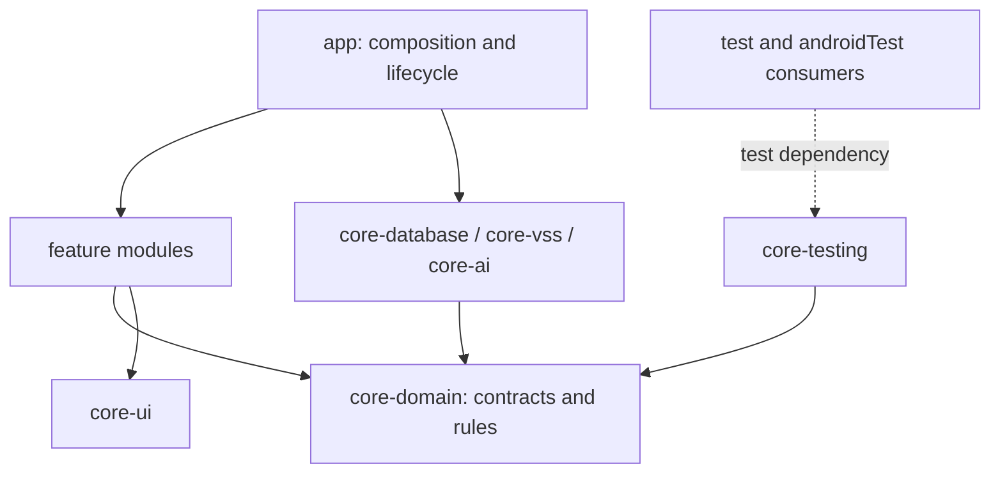

# Application architecture

Design baseline: 2026-09-10. This is the target architecture for implementation,
not a claim that every target module or feature already exists. The current
foundation implements the Q01 slice described below. See [testing status](TESTING.md)
and [the contributor guide](../.github/CONTRIBUTING.md) for the installed stack.

## Current foundation

Implemented modules are `:app`, `:core:core-domain`, `:core:core-database`,
`:core:core-vss`, `:core:core-ui`, `:feature:feature-pet`,
`:feature:feature-quest`, and `:feature:feature-vehicle-info`.

- `RivoApp` is the composition route collecting feature-owned Pet/Quest ViewModel
  state with lifecycle awareness. `CompanionDrawer` owns one typed drawer frame;
  the feature screens remain state-and-callback composables.
- Room stores one local profile, Q01 runs and completions. A single repository
  implements the separate pet/quest/reward interfaces and owns the full reward
  transaction. DataStore stores visibility and reduced-motion preferences.
- Hilt currently assembles the small repository graph in `app/di/AppModule`.
  Domain and repository constructors remain directly usable in local tests.
- `CompanionRuntime` follows process foreground lifecycle and owns one vehicle
  provider. Q01 completion is a user command; no background care tracker or
  overlay service has been introduced yet.
- Debug-only `DemoVehicleRepository` emits SIMULATED parked snapshots. Debug has
  application ID `com.devemberx.rivo.demo`, `rivo-demo.db`, and `demo-profile`;
  Release uses the REAL unavailable provider, `rivo.db`, and `local-profile`.
  The demo freshness window is 15 seconds. A real adapter must supply its verified
  freshness policy before enabling real signals; unknown state cannot authorize
  quest commands.
- Q01 needs a newer snapshot than its start sequence in the same epoch. After an
  observation gap, fresh parked evidence may cancel the old run so the user can
  start again; it cannot complete that old run. Source and profile boundaries are
  rechecked in storage.
- `core/core-ui/.../PetAvatar.kt` is the single character artwork replacement
  point: keep `PetAvatar(modifier, appearanceKey, stage)` and replace its drawing.
  The initial placeholder has no detailed asset or motion system. UI display
  preferences and progression remain independent from artwork.

Q02/Q03 are visible future quests. Chat, consented memory tables, actual vehicle
SDK integration, system overlay, and shared `core-testing` have not been added.
The remaining sections retain the target design for those subsequent increments.

## Scope and decisions

- Use feature-based Gradle modules, with MVVM and unidirectional data flow
  (UDF) inside each feature. A shared MVI Store/Reducer framework is unnecessary
  for the initial scope; explicit state transitions are still required.
- Keep quest rules and growth calculations in ordinary Kotlin classes. Use
  repositories as the public data boundary, with constructor-injected
  dependencies that tests can replace.
- Store progress, rewards, and consented memories locally in Room. Use DataStore
  for independent display preferences. There is no dedicated backend, account
  service, device synchronization, or guaranteed reinstall recovery.
- Retain real AI conversation and real vehicle-signal integration as acceptance
  requirements. Fakes enable parallel development and automated tests; they do
  not establish that the supplied environment supports an integration.
- Preserve the home, conversation, drawer, and back behavior in
  [the UI design](DESIGN.md). Text conversation and verified care quests take
  priority over voice input, additional pets, and vehicle control.

This adapts the boundaries in [MobiMon's design at commit 74891dd](https://github.com/myme4u/MobiMon/blob/74891ddb819745df1397c6ee1db236809769830e/MobiMon.md)
to the agreed quest, AI, and memory scope. Its dependency versions and driving
habit scoring are not the RIVO baseline.

Product inputs are the agreed [quest and growth rules](https://app.notion.com/p/3d3071f5db1f8140997cec6f7d991c0d)
and [AI and memory rules](https://app.notion.com/p/3d3071f5db1f81d88132fc2fd4eb1a33).
Keep the observed implementation status here and in TESTING.md current as the
target modules and tests are introduced.

## Target modules and dependencies

The table includes implemented and planned modules; see the current-foundation
list above. Add remaining modules with their first working behavior and tests;
do not create every directory as an empty scaffold.

| Gradle module | Responsibility | Allowed internal dependencies |
| --- | --- | --- |
| `:app` | Entry points, composition root, shell navigation, runtime lifecycle | Feature modules and core implementations |
| `:core:core-domain` | Plain models, repository interfaces, rules, multi-step use cases | None; Kotlin and coroutines only |
| `:core:core-database` | Room, DataStore, local repository implementations, transactions | `core-domain` |
| `:core:core-vss` | Vehicle SDK adapter, one shared observation stream, normalization | `core-domain` |
| `:core:core-ai` | Allowed AI client adapter and response parsing | `core-domain` |
| `:core:core-ui` | Theme, reusable pet renderer and controls | No feature modules |
| `:feature:feature-pet` | Companion home, pet information/selection, display settings | `core-domain`, `core-ui` |
| `:feature:feature-overlay` | Platform overlay lifecycle, permissions, rendering | `core-domain`, `core-ui` |
| `:feature:feature-vehicle-info` | Vehicle information and unavailable-state UI | `core-domain`, `core-ui` |
| `:feature:feature-quest` | Quest selection, progress, result presentation | `core-domain`, `core-ui` |
| `:feature:feature-chat` | Composer, replies, memory consent/management, session state | `core-domain`, `core-ui` |
| `:core:core-testing` | Shared JVM test builders, Fakes, coroutine rules | `core-domain`; consumers use test dependencies only |

Arrows represent compile-time dependencies. Features do not depend on each other
or on concrete DB/SDK implementations. `core-domain` does not import Android,
Compose, Room entities, Hilt annotations, or SDK DTOs. Map storage and transport
models at the implementation boundary. Keep helpers private or `internal`
unless another module needs a deliberate public contract.

Hilt assembles the current production repository graph in `app`. Keep bindings
and provider configuration at that composition boundary while implementation
classes remain in their owning modules. Provide plain domain classes through
wiring code rather than adding framework annotations to them. Local tests
construct their subjects directly and do not start Hilt. Feature ViewModels use
plain constructors and an app-owned factory.

## State, navigation, and lifecycle

A composition route obtains feature ViewModels and collects their read-only
`StateFlow<*UiState>` using `collectAsStateWithLifecycle()`. The current route is
`RivoApp`; a feature-specific `*Route` may be extracted when its entry flow needs
one. Each `*Screen` takes state, callbacks, and a `Modifier`; it does not obtain a
ViewModel, open a database, or call a vehicle/AI SDK.

Actions call named ViewModel methods; a sealed action type is useful where it
clarifies a complex flow, but not mandatory for every button. Model mutually
exclusive phases explicitly, for example `Idle`, `Sending`, and `Failed` for a
chat request. Vehicle availability, chat failures, and saved progression remain
independent parts of state. Avoid an app-wide mutable `AppState` or base class
that gives every feature unrelated responsibilities.

The shell owns typed home/drawer destinations and calls feature entry points.
The initial drawer is an in-screen state machine; it does not need a navigation
library merely because its content comes from different modules. Back moves
detail -> menu -> current home; close dismisses the drawer. Cross-feature
navigation uses callbacks and identifiers. A feature does not import another
feature's ViewModel or navigation implementation.

| State | Owner and lifetime |
| --- | --- |
| Profile, XP, quest runs, completions, memories | Repository backed by Room; survives app restarts |
| Overlay preference and reduced motion | Repository backed by DataStore; survives app restarts |
| Growth stage | Derived from saved XP by `RewardCalculator`; not independently editable |
| Current vehicle condition | Derived from current, valid signals; never inferred from saved XP |
| Recent dialogue and pending request | Profile-scoped in-memory session, shared across both home surfaces |
| Drawer destination and ordinary navigation position | Shell state; restore only appropriate non-sensitive UI state |
| Pet coordinates, hover, animation progress | UI renderer; not Room or shared business state |
| Actual overlay running/permission state | Platform controller/service observation; not a remembered Boolean |

Do not persist conversation text or pending memory proposals in Room,
DataStore, `SavedStateHandle`, or `rememberSaveable`. Keep them in the session
through navigation/configuration changes, then clear them on a new session or
process restart. Closing the composer cancels its pending request and restores
the submitted input only if that would not overwrite newer input. The last
completed exchange remains available when reopening it in the same session.

An app-owned `CompanionRuntime` coordinates one vehicle subscription and one
active-quest tracker. Its scope follows the supported foreground/overlay
lifecycle, not an individual screen collector. Reopening a route cannot create
a second SDK connection or reward processor. The overlay uses a lifecycle-owned
plain state holder; it does not retain an Activity ViewModel. Stop and clean up
listeners and jobs when their runtime ends. A UI collector stopping must not
silently stop a quest that the active runtime is still meant to observe.

App process death or an observation gap starts a new observation epoch. Restore
saved progress, but mark an interrupted care quest unverified until new evidence
or trustworthy provider history permits resuming. This design does not promise
uninterrupted background tracking. A owns verification of overlay permission and
service behavior in the supplied AAOS environment; B owns vehicle access and
driving-state availability. Restrict text interaction and quest changes to the
verified parked state; unknown driving state must not imply permission to act.

## Contracts for parallel implementation

Use `com.devemberx.rivo` as the package root, with feature and core subpackages.
Agree the following fields, units, and outcomes before connecting features.
Keep `UiState` types in their feature; only genuinely shared concepts belong in
`core-domain`.

| Contract | Required meaning |
| --- | --- |
| `VehicleSnapshot` | Signal values/units, provider measurement time when available, receive time, quality, real/simulated source, observation epoch and ordering boundary |
| `PetState` | Profile ID, character ID, XP, derived growth stage, current condition and its reason |
| `QuestRun` | Run/profile IDs, quest type, status, start boundary, revision, fixed condition version and reward, collected evidence |
| `QuestEvidence` | Evidence type and source, relevant signal or user-confirmed fact, observation boundary; not an AI assertion |
| `UserMemory` | Profile, approved key/value, consent and modification time; a proposed value is not yet memory |
| `ChatRequestContext` | Request/session IDs, memory revision, bounded dialogue, valid vehicle snapshot, committed progression and memories |

Repository APIs expose `Flow` for observations and `suspend` functions for
commands. Their contracts must define unavailable, failed, duplicate, and
cancelled outcomes, not just the successful return value.

- `VehicleRepository`: observe normalized signals and connection/quality state.
- `PetRepository`: observe profile/progression and change appearance; no public
  arbitrary XP setter.
- `QuestRepository`: observe/start/cancel the one active run per profile.
- `RewardRepository`: complete a run with evidence atomically; return applied,
  already awarded, deferred/rejected, or storage failure outcomes.
- `MemoryRepository`: observe/save/delete consented memories and report the
  committed revision.
- `SettingsRepository`: observe/change independent overlay-visibility and
  reduced-motion preferences.
- `AiGateway`: send a context snapshot and return a reply plus validated proposal
  data; never mutate Room, vehicle state, or rewards.

Use `QuestEvaluator`, `VehicleConditionResolver`, and `RewardCalculator` for
deterministic rules. Introduce use cases for actual coordination, such as
`CompleteQuestUseCase` and `SendMessageUseCase`; a settings getter need not have
a pass-through use case. Inject clocks, ID generation, dispatchers, and runtime
scopes where the behavior depends on them. Freshness uses an explicit policy
based on the provider; do not compare unrelated clock domains or reuse a
process-local monotonic timestamp across a restart.

`ObservePetStateUseCase` combines committed profile/progression observations
from `PetRepository` with the shared `VehicleRepository` stream and applies the
condition/growth rules. Home, overlay, and chat consume the resulting concept;
`core-database` does not reach into `core-vss` to assemble it. Creating another
consumer must not create another underlying vehicle subscription.

## Persistence and business invariants

Use one Room database per app process. Shared records are observed from their
repository; screens do not keep competing writable copies. The target tables
are:

| Table | Key data and constraints |
| --- | --- |
| `PetProfile` | Local profile ID, character ID, total XP; no account service required |
| `QuestRun` | Run ID, profile/type, status/revision, fixed rule/reward and evidence; enforce one active run transactionally |
| `QuestCompletion` | Completion ID, run/profile/type, awarded XP, committed evidence/time; unique `(profileId, questType)` and unique run ID |
| `UserMemory` | Unique `(profileId, key)`, approved value, consent/change time |
| `MemoryRevision` | One revision per profile, changed in the same transaction as memory save/delete |

Separate display preferences can live in DataStore. Facts required for Q02
(approved name and tone) live in Room so their committed existence can be
checked consistently. Do not split a reward transaction across Room and
DataStore. Detailed vehicle histories and chat transcripts are not initial
tables; persist only evidence needed for the active run or completed result.

Quest defaults follow the agreed v0.3 scope: Q01 acknowledges a latest available
vehicle status card, Q02 verifies saved name/tone consent, and Q03 verifies an
actual supported care signal sequence. Q03's charging candidate requires a
verified completion signal; unplugging or merely stopping charging is not
completion. Missing signal support must lead to a documented, verifiable quest
choice before integration, not a guessed successful condition.

Each of Q01-Q03 awards 80 XP once per profile. Growth stages are 0-79, 80-239,
and 240+ XP. `RewardCalculator` calculates from these explicit rules and the
run's fixed reward. Condition changes never subtract XP or downgrade growth.

Completion follows this boundary:

1. Evaluate evidence against the run's fixed rule, start boundary, and current
   observation validity. Earlier/replayed/stale/simulated evidence cannot finish
   a real care quest. Demo progression is isolated from real progression.
2. In a single Room transaction, reload the current run and recheck revision,
   active status, evidence applicability, and whether the type was already
   rewarded. This handles cancellation and concurrent completion races.
3. Insert the unique completion, mark the run complete, and increment XP only
   for a newly inserted completion. Any error rolls back all changes; a duplicate
   leaves XP unchanged. Do not use replace-on-conflict for reward records.
4. Publish committed state through repository observations. A growth animation
   or success message follows the commit; it must not trigger the award itself.

The local reward implementation owns this entire transaction, including any
domain revalidation needed inside it. Do not distribute its writes across three
independent repository calls. Keep network calls outside DB transactions. A
result ID in UI state can drive an acknowledged result presentation; a lossy
one-off event must not be the only record that a reward was granted.

## AI, memory, and failure handling

Keep at most the agreed recent ten exchanges in the in-memory session. Build
each AI request from current committed memories, completed experiences, the
active quest, and valid vehicle facts. The AI can recommend an allowlisted
quest or propose a memory change; only application commands can apply it after
the appropriate evidence or user confirmation.

Use the provider-approved application authentication or an existing allowed
relay. Shared service secrets are not application credentials. If no permitted
client connection exists, record that integration constraint for the team;
this design does not silently add a dedicated backend.

For memory save/delete, increment the committed memory revision. Reset the
current dialogue and invalidate in-flight requests at that boundary. Before
accepting a reply, check request ID, session ID, profile, and memory revision;
discard obsolete replies even when cancellation could not stop the provider.
Memory deletion does not delete quest completion/reward records. Say a memory
was saved only after successful persistence.

The initial AI timeout target is eight seconds, controlled by an injectable
policy and tested with virtual time. Retry is explicit and cannot duplicate
saved commands. AI failure leaves vehicle and progression state usable. Missing
or stale vehicle data stays unavailable; never fill it with a normal-looking
default. Preserve the last known warning as historical information when its
current status cannot be verified.

## Four-person ownership

| Owner | Feature delivery | Shared responsibility and tests |
| --- | --- | --- |
| A | Pet/home, selection/settings, shared renderer, overlay, shell integration | `app`, `core-ui`, build catalog/CI coordination, UI test harness; rendering, back, lifecycle/permission tests |
| B | Vehicle adapter, condition rules, vehicle information UI | `core-vss`, vehicle contracts/Fakes; freshness, ordering, disconnect and single-subscription tests |
| C | Quest UI, completion rules, progression persistence | `core-database` schema/version coordinator, reward contracts/Fakes; transaction, duplicate/concurrent award, reopen and migration tests |
| D | Chat UI, AI adapter, memory consent/management | `core-ai`, memory Entity/DAO/Repository and Fakes; request cancellation, timeout, stale reply and memory deletion tests |

B, C, and D build their own screens and ViewModels using A's reusable UI.
C owns `AppDatabase` registration and migrations, not every persistence file:
D writes memory persistence and coordinates schema changes with C. Each owner
maintains the tests for their behavior. A coordinates the shared test harness;
domain-specific builders/Fakes belong to their contract owner.

Before parallel implementation, agree the contracts and provide minimal Fakes
that let each consumer progress independently. Keep module dependencies and
public API changes in small PRs with affected consumers updated together.
Ownership coordinates changes; it does not add a required approval gate beyond
the repository's contribution policy.

Implement in this order:

1. Agree contracts, split the first domain/feature boundaries, and establish the
   test harness. A/B/D verify platform, vehicle, and AI access concurrently.
2. Connect one vertical slice: a valid status acknowledgement -> Q01 completion
   -> one committed 80 XP award -> home update -> restart recovery.
3. Develop vehicle conditions, remaining quest rules, and chat/memory in parallel
   behind the agreed Fakes; connect actual providers as they become available.
4. Integrate real Q03 evidence, dialogue, and growth; verify repeated completion,
   interrupted observation, memory deletion, and the three-minute demo.

On every module addition, update dependency locks, formatting/Lint/test coverage
in CI, and the commands in the contributor guide. `:app:testDebugUnitTest` does
not run the tests of its library dependencies. The initial single-module CI
must not silently become the only check for a multi-module app.

The test source layout, fixtures, acceptance matrix, and current versus future
commands are defined in [TESTING.md](TESTING.md). These rules are summarized for
coding agents in [AGENTS.md](../AGENTS.md).
